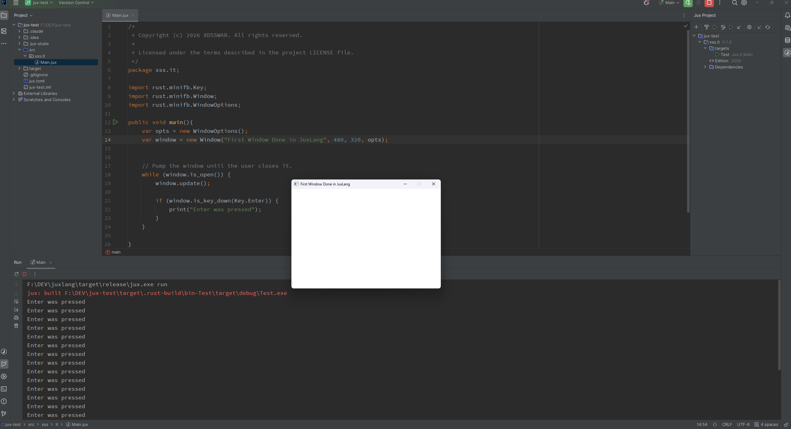
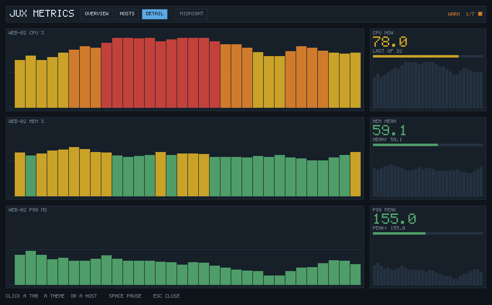
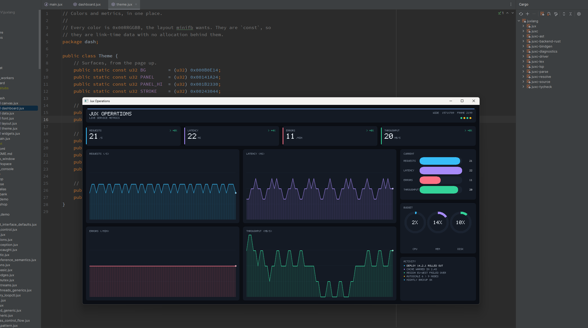

# Jux

**A Java/C#-flavored language that transpiles to Rust.** No VM, no garbage collector at runtime. Your code compiles down to a native machine-code binary through `rustc`, and you get Rust's optimizer and safety guarantees for free.

> ⚠️ **This is experimental. It is a hobby, a personal project, a work in progress.**
> It will have bugs. The docs will sometimes contradict each other because there's
> a *lot* of them and I'm one person. Things will break, change, and get rewritten.
> If that scares you, come back in a year. If it sounds fun, keep reading.

---

## Where this came from

I started sketching this idea back in **2019**, right when COVID hit and the days
stuck at home got long and boring. I wanted a language that *felt* like the ones I
already knew, Java and C#, but that didn't drag a virtual machine around with it.

I've tried to build it more than once. First in **Java**. Then in **Dart**. Both
times I learned a lot and both times I hit a wall. This is the **third attempt**,
and this time I went with **Rust** as the foundation, because honestly it's one of
the best tools out there right now for this kind of work. It compiles to fast
native code, the borrow checker catches a whole category of bugs before they ship,
and the crate ecosystem is enormous.

So instead of fighting Rust, Jux **stands on top of it**. Jux code is translated to
readable Rust source, and then `rustc` does the heavy lifting. That means Jux gets
the good parts of Rust under the hood while wearing a syntax that someone coming
from Java, C#, or even Rust itself can pick up without much friction.

**A few things I want to be straight about:**

- I'm **not an expert**. I'm a developer who's been at this a while and decided to
  stop wishing this language existed and actually build it.
- This is built by a **solo dev** (me) with help from **AI**. To be clear: the AI
  helps with research and grinding through steps, but it does **not** make the
  decisions. Every direction, every design call, every "no, do it this way" is
  mine. I drive; it assists.
- I'm **not trying to replace Rust** or compete with anything. This is a hobby that
  *might* turn into something useful for other people too. That's the whole ambition.
- It's made with love and a stupid amount of dedication, and even if it sucks right
  now, I'm genuinely happy it's at the stage it's at.

---

## The pitch, in one breath

Write in a familiar, Java-shaped language. Get a native binary. Use Rust's standard
library as your standard library. Pull in any crate on crates.io and call it with
Jux syntax. Pull in other Jux libraries straight from GitHub as dependencies. Build
real frameworks with annotations. Talk to C and C++ through FFI. And let `rustc`
optimize all of it to the metal.

That's the goal. Some of it works today, some of it is half-built, some of it is
still on paper. I'll be honest below about which is which.

**On this page:**
[screenshots](#the-first-window-jux-ever-drew) ·
[a taste of Jux](#a-taste-of-jux) ·
[the language tour](#more-of-the-language) ·
[friendly to Java hands](#friendly-to-java-hands) ·
[what works today](#what-works-today) ·
[how Jux uses Rust](#how-jux-uses-rust-the-part-im-proud-of) ·
[how the lowering works](#how-the-borrow-checker-works-and-how-we-lower-to-rust) ·
[how Jux is tested](#how-jux-is-tested) ·
[getting started](#getting-started) ·
[`jux.toml`](#project-config-juxtoml) ·
[commands](#jux-command-reference)

---

## The first window Jux ever drew



This is one of those screenshots I'm going to keep forever. It isn't a benchmark or
a clever language trick, it's a tiny empty window with a title bar, sitting on the
desktop like it owns the place. And it was drawn by a program written in **Jux**.

Look at what's actually happening here. The editor on the left is plain Jux: a
`package`, a couple of imports, a `public void main()`. It builds a window, pumps an
event loop with `while (window.is_open())`, and listens for a keypress, printing
"Enter was pressed" every time you hit Enter. The console at the bottom is that loop
running for real, line after line, as a native executable. No VM warming up in the
background, no interpreter, no runtime stitched on. Jux lowered that source to Rust,
`rustc` turned it into machine code, and the operating system handed it a real
window.

What makes it click is *how little* it took. The window isn't some bespoke widget
toolkit I had to build into the language. It's a **Rust crate** doing the drawing,
the [`fltk`](https://crates.io/crates/fltk) GUI bindings, pulled in as a dependency
and called with ordinary Jux syntax. Those `import rust.fltk.Window` lines at the
top of the file are the whole trick: a crate from crates.io, surfaced as Jux types,
constructing a real native window. It's the exact same "Rust's ecosystem is your
ecosystem" promise from the pitch above, except now you can *see* it. The day a
Java-shaped language I'd been chasing since 2019 popped up its first native window
by borrowing the entire Rust crate world, the whole thing stopped feeling like a
toy and started feeling like a tool.

It's empty on purpose. Empty windows are where every UI story starts. This one just
happens to be the first one that started in Jux.

---

## What that grew into: a real application


That empty window was 2024's milestone. This is a **fleet dashboard**, written
entirely in Jux, running as a native binary: three views, a clickable host
table, hover highlighting, a switchable palette, and a live feed updating ten
times a second. It lives in the repo at
[`examples/metrics_console`](examples/metrics_console) and you can run it now:

```bash
cd examples/metrics_console
jux run --release -p desktop
```

Nothing here is a widget toolkit. There is no UI framework, no layout engine,
and no image library. The console owns a `Vec<int>` of `0xRRGGBB` pixels and
draws into it, one rectangle at a time, with a 5x7 bitmap font written out as
pictures in the source. `rust.minifb` from crates.io puts the buffer on screen
and reports the mouse; everything above that line is Jux.

### Three views, and a click that means something

**Overview** is the fleet at a glance. Click any row and it selects that host.


**Hosts** compares them: every host, all three readings side by side.


**Detail** is one host in full, each chart graded against its own ceiling.



And the palette is a chip in the tab bar, because a dashboard should not need
a config file to be readable in daylight:


### Why it is built the way it is

Input handling is the part worth looking at. A widget that can be clicked
records the rectangles it drew into a shared hit map, tagged with what they
mean, and knows nothing else:

```java
this.hits.add(x - 4, ry - 2, w + 8, rowHeight, "host:" + host.name());
```

The console asks the map what is under a point and turns the answer into
state. So the window front end forwards two integers and no more:

```java
var mouse = window.get_mouse_pos(MouseMode.Clamp);
if (mouse != null) {
    var (fx, fy) = mouse!!;
    console.hover((int) fx, (int) fy);
    if (down && !wasDown && console.click((int) fx, (int) fy)) { ... }
}
```

Because nothing under the renderer knows a window exists, the *same* console
also runs headless, writing frames to a file. Which means the interaction is
testable with no display and no mouse attached:

```bash
jux run -- --view hosts --snapshot frame.ppm
jux run -- --click 258 28
```

Ten tests drive it that way on every build: every view, every click target,
both palettes, and the windowed binary compiled.

### Five packages, one build

```
demo.core     containers and contracts, generic in the sample type
demo.model    a fleet, how bad a reading is, and a fleet that moves
demo.render   pixels, glyphs, widgets, hit regions, layout
demo.app      arguments, and where the frame goes
demo.desktop  the same frame, in a window
```

Each is its own package with its own `jux.toml`. The dependency edges run one
way, and `jux build` walks them in order. `Aggregate<T>` is a generic
interface with a default method; `Ring<T>`, `Series<T>` and `Table<K, V>` are
generic classes used across package boundaries; `Severity` and `View` are
enums with methods and a `switch` over themselves.

**And it earned its place a second way.** Writing it found **nine compiler
bugs** that no single-file test could reach: a package named `demo.core`
shadowing Rust's own `core` crate, interface default-method bodies that were
never type-checked, a ternary over two objects that moved both arms, a
constructor that could not hold a class. Every one is fixed. That is the real
argument for building something big in a young language: the program tells you
what is broken far better than a test suite you wrote from imagination.

---

## And one that reflows: the operations dashboard



The metrics console proved a Jux program can be an application. This one asks
the harder question: can it be a *responsive* one? Same rules as before. No UI
framework, no layout engine, no drawing library.
[`examples/dashboard`](examples/dashboard) is integer arithmetic writing
`0x00RRGGBB` pixels into a buffer: rounded panels, filled line charts, bar
tracks, gauge rings, and a 5x7 bitmap font that lives in the source as plain
numbers.

```bash
cd examples/dashboard
jux run                                          # live window, resizable
jux run -- --snapshot frame.ppm --size 900x620   # one frame to a file
```

`Layout` is the only code in the whole program that decides where anything
goes. It reads the surface size, picks a breakpoint, and hands every widget the
rectangle it has to fit inside:

| Breakpoint | Width | Stat tiles | Charts | Side column |
|---|---|---|---|---|
| Wide | 1080+ | 4 across | 2 columns | yes |
| Medium | 720-1079 | 2 across | 1 column | yes, narrower |
| Compact | under 720 | stacked | 1 column | dropped |

Drag the window edge and the four stat tiles become two and then one, the
charts collapse into a single column, and the side rail drops away. No widget
knows the window resized; they are simply asked to draw somewhere else. The
header prints the breakpoint it chose beside the surface size and the frame
counter, the `WIDE 1571X789 FRAME 2199` in the shot above, so the rearrangement
is something you can see rather than something I claim.

The `dash` package still knows nothing about windows. That is what lets the
same frame go to a resizable `rust.minifb` window or straight to a file, and it
is why a test can render three different sizes headless and check the layout
really does respond.

**Writing it found seven more compiler bugs**, none of them about dashboards. A
cast on the left of a shift did not compile, and `r as u32 << 16` is every
pixel-packing routine ever written. `char` arithmetic skipped promotion when
one operand was a literal, so `ch - '0'` was wrong. A `for`-each variable had
no type unless it was a class. An early `return;` in a constructor returned
nothing. A static call moved its arguments, so `Font.draw(text, Font.width(text))`
failed over a value the program never gave away. All seven are fixed.

---

## A taste of Jux

If you've written Java or C#, none of this needs a tutorial:

```java
public abstract class Animal {
    public String name;
    public Animal(String name) { this.name = name; }
    public abstract String sound();
}

public interface Tagged { String tag(); }

public class Dog extends Animal {
    public Dog(String name) { super(name); }
    public String sound() { return "Woof"; }
    public String fetch() { return "fetched"; }
}

public class Cat extends Animal implements Tagged {
    public Cat(String name) { super(name); }
    public String sound() { return "Meow"; }
    public String tag()    { return "cat-tag"; }
}

public void main() {
    Animal a = new Dog("Rex");
    a.name = "Max";                 // field access through a base reference
    print(a.sound());               // virtual dispatch, prints "Woof"

    Dog d = a as Dog;               // explicit downcast
    print(d.fetch());

    Animal b = new Cat("Felix");
    if (b => Cat) {                 // `=>` is the instanceof / type-test operator
        Cat c = b as Cat;
        print($"${c.name} says ${c.sound()} / ${c.tag()}");
    }
}
```

Familiar shape, but the semantics are Jux's own, and all of it compiles straight to
native code through Rust. (This is a real example;
see [`examples/downcast_typetest.jux`](examples/downcast_typetest.jux).)

---

## More of the language

A tour of the stuff that makes Jux fun to write. Everything below is real,
compiling syntax (most of it lifted straight out of [`examples/`](examples/)).

### Structs and generics

```java
public struct Vec2 {
    public double x = 0.0;        // fields need a default or constructor assignment
    public double y = 0.0;
    public double lengthSquared() { return x * x + y * y; }
}

// A generic container, instantiated with a turbofish or by inference.
public class Box<T> {
    private T value;
    public Box(T value) { this.value = value; }
    public T get() { return this.value; }
}

// Bounded type parameter: T must be an Animal AND implement Speaks.
public class Holder<T extends Animal & Speaks> {
    public T pet;
    public Holder(T pet) { this.pet = pet; }
    public String describe() { return this.pet.voice(); }
}

var b = new Box<int>(42);        // explicit type argument
var v = new Vec2();              // v.x = 3.0; v.y = 4.0; ...
```

### Enums and pattern matching

One `enum` keyword covers three jobs: a C-style set of named constants, a
Java-style enum with methods and fields, and a Rust-style sum type whose variants
carry payloads. You destructure them with `switch` and exhaustiveness is checked,
so a forgotten variant is a compile error, not a runtime surprise.

```java
public enum Shape {
    Circle(double),               // payload-carrying variants
    Rect(double, double)
}

public double area(Shape s) {
    switch (s) {
        case Shape.Circle(var r)     -> { return 3.14159 * r * r; }
        case Shape.Rect(var w, var h) -> { return w * h; }
    }
}
```

Variants may name the enum itself, so the classic recursive trees (expressions,
JSON, parse trees) just work. The self-referential slot is heap-indirected for
you; there is no special syntax and no manual boxing:

```java
public enum Expr {
    Num(int),
    Add(Expr, Expr),              // self-referential payload
    Mul(Expr, Expr)
}

public int eval(Expr e) {
    switch (e) {
        case Expr.Num(var n)        -> { return n; }
        case Expr.Add(var a, var b) -> { return eval(a) + eval(b); }
        case Expr.Mul(var a, var b) -> { return eval(a) * eval(b); }
    }
}

// (2 + 3) * 4 == 20
var tree = Expr.Mul(Expr.Add(Expr.Num(2), Expr.Num(3)), Expr.Num(4));
print(eval(tree));
```

How Jux enums stack up against C and Java:

| Feature                              | C enum | Java enum | Jux enum         |
|--------------------------------------|--------|-----------|------------------|
| Named variants                       | ✓      | ✓         | ✓                |
| Methods                              | ✗      | ✓         | ✓                |
| Payloads on variants                 | ✗      | ✗         | ✓                |
| Recursive variants (trees)           | ✗      | ✗         | ✓                |
| Pattern matching with destructuring  | ✗      | partial   | ✓                |
| Exhaustiveness check                 | ✗      | ✓         | ✓                |
| `name()`, `ordinal()`, `values()`    | ✗      | ✓         | ✓                |
| FFI bit-compatible                   | native | ✗         | via `@layout(c)` |
| Auto-derived `==`, hash, string      | n/a    | identity  | ✓ structural     |
| Sealed (closed set of variants)      | ✓      | ✓         | ✓                |

Same keyword does it all: you pick the pattern that fits the case, and the
compiler picks the representation that fits the pattern.

### Operator overloading

Overload arithmetic, equality, hashing, and the string conversion. `operator==`
must be paired with `operator hash` (the compiler enforces it with `E0931`).

```java
public class Money {
    public int cents;
    public Money(int cents) { this.cents = cents; }

    public Money  operator+(Money other) { return new Money(this.cents + other.cents); }
    public Money  operator-(Money other) { return new Money(this.cents - other.cents); }
    public bool   operator==(Money other) { return this.cents == other.cents; }
    public int    operator hash()         { return this.cents; }
    public String operator string()       { return $"$${this.cents}"; }
}

var total = new Money(150) + new Money(50);   // both operands stay usable afterward
print($"total=$total");                       // total=$200
```

### Indexers: overloading `[]`

You can also overload the subscript operator `[]`, the same way C# has indexers
and C++ has `operator[]`. It comes as a **read/write pair**: `operator[]` defines
what `w[i]` returns, and `operator[]=` defines what `w[i] = v` does. That lets a
class expose clean array-style access while keeping its storage private.

```java
import rust.std.Vec;

public class Wallet {
    private Vec<int> slots;                    // private backing store
    public Wallet() {
        this.slots = new Vec<int>();
        this.slots.push(10);
        this.slots.push(20);
    }

    // index read:  evaluated for  w[i]
    public int  operator[](int i)          { return this.slots[i]; }
    // index write: evaluated for  w[i] = v
    public void operator[]=(int i, int v)  { this.slots[i] = v; }
}

public void main() {
    var w = new Wallet();
    print(w[0]);          // 10    calls operator[]
    w[1] = 99;            //       calls operator[]=
    w[0] += w[1];         // both! reads w[0] and w[1], then writes back
    print(w[0]);          // 109
}
```

That last line is the fun one: a compound assignment through an indexer fires
**both** operators in a single statement, the getter to read and the setter to
write back. The `operator[]` / `operator[]=` bodies lower to inherent methods, and
`w[i]` at the call site maps onto Rust's `Index`/`IndexMut` shape, so the emitted
Rust still reads naturally.

### Type aliases, `sizeof`, `typeof`

```java
public type UserId = long;             // transparent alias
public type Predicate = (int) -> bool; // function-type alias

public void main() {
    UserId id = 42;
    print(sizeof(UserId));             // 8   (compile-time size query)
    print(typeof(id));                 // long

    Predicate even = (n) -> n % 2 == 0;
    print(even(10));                   // true
}
```

### Grouped imports

Pull several names from one package with brace syntax, just like the frameworks
Jux is built to host:

```java
import rust.std.{HashMap, HashSet};
import juxweb.{Server, Controller, Route, PathParam};
```

### Properties, with observers

Properties read and write like fields, but they can be computed, bound to one
another, and observed. This is one of Jux's signature features.

```java
public class Person {
    public String First { get; set; } = "";
    public String Last  { get; set; } = "";
    // Computed property: re-fires whenever First or Last changes.
    public String FullName { get -> First + "/" + Last; };
}

public class Source { public int Value { get; set; } = 10; }
public class Mirror {
    public int Shown { get; set; } = 0;
    public Mirror(Source s) { this.Shown.bind(s.Value); }   // one-way binding
}

var p = new Person();
p.FullName.observers.attach((old, now) -> print($"name: $old -> $now"));
p.First = "Ada";                  // fires the observer
p.Last  = "Lovelace";             // fires again

var s = new Source();
var m = new Mirror(s);            // m.Shown starts synced to s.Value
s.Value = 42;                     // m.Shown now follows to 42

a.Value.bindBidirectional(b.Value);   // two-way; either side updates the other
a.Value.unbind();                     // break the binding
```

### Async, channels, and spawned tasks

`async`/`await` lower to real Rust futures; `spawn` launches a concurrent task and
`Channel<T>` gives you a bounded producer/consumer pipe.

```java
async void pipeline() {
    var ch = new Channel<int>(4);
    spawn(async () -> {
        for (var i : 1..=5) { await ch.send(i * 10); }
        ch.close();
    });

    var total = 0;
    while (true) {
        var item = await ch.receive();    // null once closed and drained
        if (item == null) { break; }
        total = total + item!!;           // `!!` unwraps a nullable
    }
    print(total);                         // 150
}

public void main() { block_on(pipeline()); }
```

### Real threads: workers and atomics

When you want genuine multi-core parallelism (not just cooperative tasks),
`Worker.spawn` runs a closure on a real OS thread and hands you back a `Task` you
can `await`. Shared state goes through atomics like `AtomicInt`, which are safe to
hand to several workers at once.

```java
import jux.std.concurrent.AtomicInt;

public int crunch(String tag, int iters) {
    var acc = 0;
    for (var i : 0..iters) { acc = (acc + i) * 7 % 9973; }
    print($"  [worker $tag] acc=$acc");
    return acc;
}

public async void main() {
    // Fan CPU-bound work out across real threads, then gather the results.
    final var a = Worker.spawn(() -> crunch("A", 1_000_000));
    final var b = Worker.spawn(() -> crunch("B", 1_000_000));

    // One shared, thread-safe counter that every worker bumps.
    var hits = new AtomicInt(0);
    final var c = Worker.spawn(() -> {
        for (var i : 0..1000) { hits.fetchAdd(1); }   // atomic increment
        return 0;
    });

    final int ra = await a;
    final int rb = await b;
    await c;

    print($"results: A=$ra B=$rb");
    print($"hits = ${hits.load()}");      // 1000
}
```

`Worker.spawn` is true preemptive parallelism backed by OS threads; `AtomicInt`
(and friends, with explicit `MemoryOrder`) lower to `Arc<Atomic*>`, so the handle
the workers share really is one counter.

### Memory: `drop`, `weak`, and `ref`

Jux has no tracing garbage collector. Class instances are reference-counted (that
`Rc<RefCell>` lowering from earlier), and three constructs give you direct control
over lifetime and sharing.

**`drop { }` is a deterministic destructor.** It runs at scope exit for a local,
and for a class instance exactly once, when the last strong reference is released.
No finalizer queue, no nondeterminism.

```java
public class Resource {
    public String name;
    public Resource(String name) { this.name = name; print("open " + name); }
    drop { print("close " + name); }      // `this` is in scope here
}

public void main() {
    var a = new Resource("a");
    var b = a;                  // a SECOND handle to the same resource
    print("using " + b.name);
}   // "close a" prints once here, when the last handle dies
```

**`weak` breaks reference cycles.** A `weak` reference doesn't bump the refcount,
so it never keeps its target alive. Promote it to a strong reference with `.get()`,
which returns `T?` (null if the target is gone). This is how a `Parent <-> Child`
back-reference avoids leaking without a GC.

```java
public class Child {
    private weak Parent parent;             // no refcount contribution
    public void attach(Parent p) { this.parent = p; }
    public void callUp() {
        var p = this.parent.get();          // Parent?  promote weak -> strong
        if (p != null) { p.greet(); } else { print("(no parent)"); }
    }
}
```

**`ref` gives you a shared, writable handle to a value type.** Normally primitives
and value types copy; a `ref` binding (or `ref` parameter) aliases the *same* cell,
so a write is visible through every handle, including the caller's.

```java
void bump(ref int n) { n += 5; }            // mutates the CALLER's variable

public void main() {
    ref int n = 10;
    ref int m = n;                           // m aliases n's cell
    bump(n);
    print(m);                                // 15 (same cell throughout)
}
```

`unsafe { }` blocks, `unsafe` functions, and the raw-pointer basics work today:
`T*` types, address-of a local (`&n`), and dereference (`*p`), all gated to an
`unsafe` context (the type checker raises `E0506` outside one). The example below
compiles and runs:

```java
public unsafe void store(int* p, int value) { *p = value; }

public void main() {
    int n = 10;
    unsafe {
        int* p = &n;
        store(p, *p * 2);
    }
    print($"n = $n");          // n = 20
}
```

Taking the address of an object (`&obj`) works too, and pointers can live in
fields. Freeing memory needs no `delete` keyword by design: you call the foreign
deallocator inside `unsafe`, from a `drop { }` destructor (writing `delete p;`
is guided there by a diagnostic).

### Records: data classes with no boilerplate

A `record` is an immutable data carrier. Equality, hashing and printing come for
free, a **compact constructor** validates or normalizes the components before they
are stored, and extra constructors chain to the canonical one with `this(...)`.

```java
record Range(int lo, int hi) {
    Range {                                  // compact constructor
        if (lo > hi) { int t = lo; lo = hi; hi = t; }   // normalize, don't reject
    }
    Range(int single) { this(single, single); }
    public int length() { return hi - lo; }
}

record Temperature(double celsius) {
    Temperature {
        if (celsius < -273.15) {
            throw new IllegalArgumentException($"below absolute zero: ${celsius}");
        }
    }
}

print(new Range(9, 2));                      // Range(lo: 2, hi: 9)
print(new Range(3, 8).length());             // 5
```

Need a changed copy? `with(...)` builds one, naming only the components that
change, and it nests:

```java
record Address(String city, String country) {}
record User(String name, Address addr) {}

var u  = new User("Alice", new Address("Paris", "FR"));
var u2 = u.with(addr: u.addr.with(city: "Lyon"));   // u is untouched
```

### Sealed hierarchies and real pattern matching

A `sealed interface` closes its set of implementations, so a `switch` over it is
checked for exhaustiveness with no `default`. Patterns take records apart in the
same step that tests their type, can hold literals, and can carry a `when` guard.

```java
sealed interface Shape permits Circle, Square, Triangle {}
record Circle(double radius) implements Shape {}
record Square(double side) implements Shape {}
record Triangle(double base, double height) implements Shape {}

String describe(Shape s) {
    return switch (s) {
        case Circle(0.0) -> "a point";                         // literal inside a pattern
        case Circle(var r) when r > 100.0 -> "a huge circle";  // guard
        case Circle(var r) -> $"a circle of radius ${r}";
        case Square sq -> $"a square of side ${sq.side}";      // type pattern with a binder
        case Triangle t -> "a triangle";
    };                                                         // no default: the set is closed
}
```

**Or-patterns bind names too.** When every alternative binds the same name with
the same type, the arm body sees one variable, whichever alternative matched:

```java
sealed interface Expr permits Num, Neg, Twice {}
record Num(int v) implements Expr {}
record Neg(int v) implements Expr {}
record Twice(int v) implements Expr {}

int magnitude(Expr e) {
    return switch (e) {
        case Num(var n) | Neg(var n) -> n;
        case Twice(var n) -> 2 * n;
    };
}

String pair((int, int) p) {                  // tuples match the same way
    return switch (p) {
        case (0, var y) | (var y, 0) -> "axis " + y;
        case (var a, var b) when a == b -> "diag " + a;
        default -> "other";
    };
}
```

### Tuples and destructuring

Tuples are anonymous, fixed-size value groups: handy for returning two things
without inventing a class. A declaration can take tuples and records apart, at any
depth, with `_` to skip a part:

```java
(int, int) divmod(int a, int b) { return (a / b, a % b); }

record Pt(int x, int y) {}
record Line(Pt start, Pt end) {}

public void main() {
    var (q, r) = divmod(17, 5);                    // 3, 2
    var pair = divmod(22, 7);
    print(pair.0 + pair.1);

    var l = new Line(new Pt(1, 2), new Pt(3, 4));
    var Line(Pt(ax, ay), Pt(bx, by)) = l;          // nested, one line
    var Line(Pt(_, var y1), var end) = l;          // skip parts, keep a whole record
    print((bx - ax) * (by - ay));
}
```

### Null safety that the compiler actually tracks

A type is non-null unless it says otherwise. `T?` may be `null`, and the compiler
will not let you use it as a `T` until you have checked it. The checks you would
write anyway are the ones it understands:

```java
String require(String? s) {
    return s ?: throw new IllegalArgumentException("missing value");   // s is a String after this
}

int total(Node? head) {
    Node? cur = head;
    int sum = 0;
    while (cur != null) {        // cur is a Node inside the loop
        sum += cur.value;
        cur = cur.next;
    }
    return sum;
}

public void main() {
    int? present = 5;
    print(present ?? expensive());   // `??` short-circuits: expensive() never runs here
    Node? gone = null;
    var r = gone?.step();            // `?.` skips the whole call on null
    Animal pet = new Dog();
    if (pet => Dog) print(pet.bark());   // `=>` type test, then pet IS a Dog in the branch
    String name = maybeName()!!;     // `!!` asserts non-null (throws if it is null)
}
```

### Operators, taken all the way

Arithmetic, comparison, equality, hashing, indexing, ranges and text are all
**operator overrides**, never magic method names. There is no `equals`,
`hashCode`, `compareTo` or `toString` to remember: you override `operator==`,
`operator hash`, `operator<=>` and `operator string`.

**One operator, several operand types.** The right operand picks the overload the
way a call picks a method, and each overload has its own return type:

```java
class Vec2 {
    public double x;
    public double y;
    public Vec2(double x, double y) { this.x = x; this.y = y; }

    public Vec2   operator*(double k)   { return new Vec2(x * k, y * k); }      // scale
    public double operator*(Vec2 other) { return x * other.x + y * other.y; }  // dot product
    public Vec2   operator+(Vec2 other) { return new Vec2(x + other.x, y + other.y); }
    public String operator string()     { return $"(${x}, ${y})"; }
}

var a = new Vec2(1.0, 2.0);
var b = new Vec2(3.0, 4.0);
Vec2   doubled = a * 2.0;       // (2.0, 4.0)
double dot     = a * b;         // 11.0
a *= 10.0;                      // compound assignment picks the same way
```

**`<=>` gives you the whole ordering.** Define one three-way comparison and
`<`, `<=`, `>`, `>=` all follow, for your own types and for sorting:

```java
class Version {
    private int major;
    private int minor;
    Version(int major, int minor) { this.major = major; this.minor = minor; }

    public int operator <=>(Version other) {
        if (this.major != other.major) { return this.major <=> other.major; }
        return this.minor <=> other.minor;
    }
}

print(new Version(1, 9) < new Version(2, 0));   // true
```

**Operators in interfaces, used as generic bounds.** An interface can declare an
operator as a contract, and generic code bounded by it can simply write `a + b`:

```java
interface Addable<T>  { T operator+(T other); }
interface Scalable<T> { T operator*(double k); }

<T extends Addable<T>> T sum(Vec<T> items, T zero) {
    var total = zero;
    for (var item : items) { total = total + item; }
    return total;
}

<T extends Addable<T> & Scalable<T>> T midpoint(T a, T b) {
    return (a + b) * 0.5;       // two bounds, two operators, one expression
}
```

**Ranges of your own types.** `a..b` and `a..=b` call `operator..` / `operator..=`,
so a for-each can walk dates, versions or anything else you define:

```java
record Date(int day) {
    public Vec<Date> operator..=(Date end) {
        var out = new Vec<Date>();
        for (int d = day; d <= end.day; d++) { out.push(new Date(d)); }
        return out;
    }
}

for (var d : new Date(10)..=new Date(12)) { print(d.day); }   // 10, 11, 12
```

### Generators: `yield`

A function that `yield`s returns an `Iterator<T>` and runs only as far as the
caller asks, so endless sequences are fine. `yield*` hands over to another
iterator, which makes a recursive tree walk a few lines long. An `async`
generator returns a `Stream<T>` you read with `for await`.

```java
Iterator<long> fibonacci() {
    long a = 0;
    long b = 1;
    while (true) {              // endless, and that's fine
        yield a;
        var next = a + b;
        a = b;
        b = next;
    }
}

Iterator<int> inOrder(Node? node) {
    if (node == null) { return; }   // `return;` ends the sequence
    yield* inOrder(node.left);
    yield node.value;
    yield* inOrder(node.right);
}

Iterator<int> evens(Iterator<int> source) {   // a lazy pipeline stage
    for (var n : source) {
        if (n % 2 == 0) { yield n; }
    }
}
```

### Default parameters and named arguments

Defaults are evaluated at the call site, fresh on every call (no shared mutable
default trap), and any argument can be passed by name. It works on functions,
methods and constructors alike:

```java
void connect(String host, int port = 80, int timeout = 30) {
    print($"$host:$port (t=$timeout)");
}

connect("example.com");                          // example.com:80 (t=30)
connect("example.com", port: 443);               // example.com:443 (t=30)
connect("example.com", timeout: 60, port: 443);  // any order once named
```

Overloading by parameter type works for free functions and methods, and `T...`
varargs take any number of arguments (or an array).

### Exceptions, the Java way, plus `Result` and `?`

`try` / `catch` / `finally` behave like Java's, including checked exceptions:
a body that can throw a checked exception must catch it or declare it with
`throws` (error `E0711` otherwise). Multi-catch handles unrelated types with one
body, and `finally` always runs first, even when a catch body throws.

```java
class ConfigError extends Exception { ConfigError(String m) { super(m); } }

void load() throws ConfigError { throw new ConfigError("bad host"); }

void risky(int kind) throws NetError, TimeoutError { ... }

public void main() {
    try {
        load();
    } catch (ConfigError e) {
        print("recovered: " + e.getMessage());
    }

    try {
        risky(0);
    } catch (NetError | TimeoutError e) {          // multi-catch
        print("transient: " + e.getMessage());
    } finally {
        print("always runs");
    }
}
```

When you'd rather return errors as values, `Result<T, E>` and the `?` operator
propagate them, and `?` works on nullables too:

```java
Result<int, String> parsePort(String s) {
    if (s == "80") { return Result.Ok(80); }
    return Result.Err("bad port: " + s);
}

Result<String, String> describe(String s) {
    var port = parsePort(s)?;             // Ok unwraps, Err returns early
    return Result.Ok("port is " + port);
}
```

### Conditional compilation

`@cfg(...)` keeps a declaration in or out of the build, and `if cfg(...)` does
the same inside a body. What a build leaves out is gone, so it may even call
functions that only exist on another target:

```java
@cfg(os = "windows")
public String home() { return "C:\\Users"; }

@cfg(not(os = "windows"))
public String home() { return "/home"; }

public void main() {
    if cfg(feature = "verbose") {        // features are declared in jux.toml
        print("verbose build");
    }
}
```

### Testing is built in

`jux test` finds every `@Test` function and runs it, with `@BeforeAll`,
`@BeforeEach`, `@AfterEach` and `@AfterAll` hooks and the usual assertions,
including `assertThrows<E>`:

```java
import jux.std.testing.*;

int divide(int a, int b) { return a / b; }

@Test
void numbersAddUp() {
    assertEqual(4, 2 + 2);
    assertNear(0.3, 0.1 + 0.2, 1e-9);
}

@Test
void divisionByZeroThrows() {
    assertThrows<ArithmeticException>(() -> divide(1, 0));
}
```

---

## Friendly to Java hands

Jux looks like Java on purpose, so Java habits are the most common mistakes. The
compiler recognizes them and tells you the Jux way instead of just saying "no":

```text
app.jux:3:5: [E0413] error: no method `add` on type `rust.std.Vec` -- Jux collections are the Rust std ones: use `push` or `insert`
app.jux:9:11: [E0413] error: no method `equals` on type `Point` -- equality is an operator: write `a == b` (override `operator==` to define it)
app.jux:12:11: [E0413] error: no method `toString` on type `Point` -- a value's text is its `operator string` (override it to define it): interpolate it, `$"${x}"`, or call `x.operator string()`
app.jux:13:11: [E0413] error: no method `getOwner` on type `Account` -- `Owner` is read directly: `x.Owner`, with no call
app.jux:2:5: [E0301] error: cannot find `System` in this scope -- Jux prints with `print(...)`; format with interpolation, `print($"${x}")`
app.jux:4:22: [E0200] error: an array literal is written with braces: `{a, b, c}`, not `[a, b, c]`
```

Every diagnostic has a code, a precise span and, where there is an obvious fix, a
hint. Errors are Jux's own: the goal is that a mistake in Jux code is reported by
`juxc` in Jux terms and never leaks through as a confusing `rustc` error about
code you did not write.

---

## What works today

The pipeline runs end to end: **lex, parse, resolve, typecheck, lower-to-Rust,
`cargo build`, run.** Roughly anything in [`examples/`](examples/) compiles and
runs. That currently includes:

- **Classes:** fields, constructors, methods, `static`/`final`, visibility,
  bare field access (`f` is `this.f`), and C#-style **properties**
  (`{ get; set; }`, expression-bodied with `->`).
- **Inheritance & polymorphism:** `extends`, `super(...)`, overrides, abstract
  classes, `sealed`/`non-sealed`, virtual dispatch, downcasts (`as` / `(T)`), and
  the `=>` instanceof / type-test operator. Classes are **shared references**
  (Java semantics), not values.
- **Interfaces:** default methods, static methods, constants. Single-class,
  multi-interface inheritance, like Java.
- **Generics:** `class A<T>`, bounded type params, wildcards (`? extends`,
  `? super`), const generics (`<int N>`), explicit type arguments.
- **Enums + `switch`** with exhaustiveness checking, payload binding, and
  recursive variants (`Add(Expr, Expr)` self-referential trees, auto-boxed).
  Enums get `name()`, `ordinal()`, `fromName()`, `fromOrdinal()` and `cases()`.
- **Pattern matching:** record patterns, type patterns with binders, literal
  patterns, `when` guards, ranges, or-patterns that bind names, tuple patterns,
  and nested destructuring declarations. `sealed` interfaces make a `switch`
  exhaustive with no `default`.
- **Records** (compact and extra constructors, `with(...)`), **tuples**,
  **lambdas & method references** (including `async` lambdas), **generators**
  (`yield` / `yield*` to `Iterator<T>`, async generators to `Stream<T>`).
- **Operators:** arithmetic, comparison, `<=>` (which derives `<` `<=` `>` `>=`),
  `==` + `hash`, `string`, indexers `[]` / `[]=`, compound assignment, free
  operators, overloads by operand type, operators in interfaces and generic
  bounds, and `..` / `..=` on your own types.
- **Null safety:** `T?`, `?.`, `??`, `?:` (including `?: throw`), `!!`, and flow
  narrowing after `!= null`, `=>` type tests, `assert`, and guard clauses.
- **Parameters:** defaults, named arguments, `T...` varargs, overloading by type
  (free functions too), `out` parameters, `final` / `weak` / `ref` parameters.
- **Exceptions:** `try` / `catch` / `finally`, checked exceptions with `throws`,
  multi-catch, exception causes, plus `Result<T, E>` and the `?` operator.
- **Annotations** declared in Jux (`public annotation Route { ... }`), checked at
  compile time, with a generated registry for runtime-retention ones (this is how
  the HTTP example routes requests with no reflection).
- **Conditional compilation:** `@cfg(...)` on declarations and `if cfg(...)` in
  bodies, with features declared in `jux.toml`.
- **String interpolation:** `$"hello ${name}"`, plus raw strings.
- **Observable properties:** `observer<T>`, binding, bidirectional binding.
- **Async/streams, a testing framework, exceptions** (`try`/`catch`/`finally`).
- **Concurrency:** `async`/`await`, `spawn` tasks, `Channel<T>`, real-thread
  `Worker.spawn`, and atomics (`AtomicInt`/`AtomicLong` with `MemoryOrder`).
- **Memory control:** `drop { }` deterministic destructors, `weak` references
  (cycle-breaking, `.get()` to promote), and `ref` bindings/params (shared,
  writable handles to value types). No tracing GC.
- **Multi-file workspaces:** cross-file `import`s, package-private visibility,
  and `jux.toml`-driven multi-module project builds with per-module binary
  metadata (version, author, icon).
- **Optimized release builds:** `--release` emits a tuned `[profile.release]` by
  default (`opt-level = 3`, thin LTO, `codegen-units = 1`, `strip`), so
  `jux build --release` is fully optimized out of the box; any key you set in
  `jux.toml` overrides the default. A [`benchmarks/`](benchmarks/) harness tracks
  numeric / allocation / dispatch / object-graph / startup performance.

## What's stubbed or in progress

- `jux new` scaffolds a project and `jux test` runs `@Test` functions today;
  `jux bench` is not added yet.
- `rust.std` and crate coverage is wide but not total: construction, methods,
  free functions, statics and trait methods work (the HTTP and TCP examples run
  on `std::io` and `tiny_http`); the gaps are listed just below.
- **C FFI** works for the common case: declare C functions in an
  `@extern(lib = "…") unsafe native { … }` block and call them inside `unsafe`.
  System libraries link via `#[link]`; custom libraries are configured with an
  `[ffi.<name>]` table in `jux.toml` (`lib_path`, `linkage`, `extra_libs`),
  which drives the generated `build.rs` link step. Strings cross as ordinary
  `String` (the compiler marshals to/from C `const char*` automatically; there
  is no `CString`). `out` parameters work too (`out long ticks` → the C function
  writes the place), and `@layout(c)` **C-compatible value structs** pass by
  value or get filled through a pointer (Win32 `GetCursorPos(out POINT)` works).
  The reverse direction works too: `@export` gives a Jux function C linkage
  (`#[no_mangle] extern "C"`) so C can call it, including `String` params/returns
  (marshalled to/from `const char*` by a generated wrapper).
  `@layout(c, repr = "i32")` **C enums** lower to a `#[repr(i32)]` integer enum
  with explicit discriminants (`Ok = 200`) for status-code style C APIs. **C
  variadics** work too
  (`int printf(String fmt, ...)` calls, with String literals marshalled to
  `const char*`). See
  [`examples/ffi_strings.jux`](examples/ffi_strings.jux),
  [`examples/ffi_struct.jux`](examples/ffi_struct.jux),
  [`examples/ffi_enum.jux`](examples/ffi_enum.jux),
  [`examples/ffi_variadic.jux`](examples/ffi_variadic.jux), and
  [`examples/ffi_export.jux`](examples/ffi_export.jux). Still to come: header
  `bindgen` and C++.
- Raw-pointer basics work (`T*`, `void*`, `&local`, `&obj`, `*p` inside `unsafe`,
  pointer fields, function pointers). There is no `delete` keyword by design
  (`delete p;` is guided to the `drop { }` + foreign-`free` model).
- **Rust std discovery has gaps.** Everything is discovered from rustdoc, never
  hand-listed, and a few corners are not reached yet: the `f64` math methods on
  `double` (`powf`, `sin`, ...), iterator adaptors, and trait methods that come
  from blanket or cross-crate impls. The [Jux lessons](tests/lessons/README.md)
  track each one with a repro.
- **Real language gaps, logged and not invented yet:** `union`, inline `asm`,
  custom allocators and arenas, and compile-time version/source-location queries.
- `move` is reserved but not implemented; classes share by reference counting.
- Expect bugs. This is experimental, one person is building it, and corners of the
  language will break, change, or get rewritten without warning. File issues.

---

## How Jux uses Rust (the part I'm proud of)

### The standard library is Rust's standard library

There's no separate "Jux runtime library" to reinvent. **Rust's `std` is the Jux
`std`**, and any Rust crate is fair game, surfaced in Jux syntax.

```java
import rust.std.PathBuf;

var p = new PathBuf();   // lowers to std::path::PathBuf::new()
p.reserve(16);           // camelCase method maps to the real snake_case one
```

The types Rust's own prelude puts in scope everywhere (`Vec`, `String`,
`HashMap`, `Option`) need no import in Jux either. Anything else is one
`import rust.std.<Name>;` away, or a group:

```java
import rust.std.{HashMap, HashSet};
```

Hover, autocomplete, and go-to-definition over `std` and your project's crates are
generated **on demand** from the installed toolchain's rustdoc JSON
(`juxc-bindgen`): nothing is hand-curated, so it tracks whatever Rust version you
actually have. Collections are Rust's collections under their real names: `Vec`,
`HashMap`, `HashSet`, `VecDeque`. There is no parallel Jux collection library and
no Java-style facade over Rust's: `push`, `len` and `insert` are the method names,
because they are Rust's.

### Dependencies: crates *and* Jux libraries

- **Rust crates** from crates.io (or a path, or git), consumed and called with Jux
  syntax. Add `"rust.tiny_http" = "0.12"` to `jux.toml` and `import
  rust.tiny_http.Server;` just works: the compiler reads the crate's rustdoc,
  writes a Jux-syntax stub for type checking, and links the crate into the build.
  Member names stay exactly as the crate spells them (`is_open`, `recv`), so the
  crate's own docs apply.
- **Jux libraries straight from GitHub.** Point at a repo (with branch / tag /
  rev, or a bare-URL shorthand), and `jux` resolves and caches it under `~/.jux`.
  Cross-compilation via `--target <triple>` is supported.

### Annotations for frameworks

Annotations are declared in Jux, checked at compile time, and the compiler writes
every runtime-retention use into a generated registry. That is the Spring-Boot
shape without a reflection runtime. Here is the real HTTP server from
[`examples/http_server`](examples/http_server), a crates.io socket library plus an
annotation router:

```java
import rust.tiny_http.Server;
import rust.tiny_http.Response;
import jux.meta.Registry;
import jux.std.meta.AnnotatedItem;

@Retention(RUNTIME)
public annotation Route {
    String path();
    String method() default "GET";
}

public class Api {
    @Route(path = "/health")
    public String health() { return "ok\n"; }
}

/** The handler whose `@Route` path matches `url`, or null. */
public AnnotatedItem? routeFor(String url) {
    for (var r : Registry.annotated("Route")) {
        if (r.getOr("path", "") == url) { return r; }
    }
    return null;
}

public void main() {
    var server = Server.http("127.0.0.1:9091");
    while (true) {
        var request = server.recv();
        var route = routeFor(request.url());
        // ... dispatch to the handler, answer with a tiny_http Response
    }
}
```

Nothing in the program keeps a list of routes. Adding an endpoint is one annotated
method, and the router finds it on the next build.

### C / C++ FFI

**C interop works today.** You can declare, link, and call C functions
(`@extern unsafe native`), with automatic `String`/`char` marshalling, `out`
parameters, `@layout(c)` value structs and `repr` C enums (including a C enum as
a struct field), C variadics (`printf`-style `...`), custom-library linking via
`[ffi.*]` in `jux.toml`, and `@export` to call Jux *from* C (with `String`
marshalling). See the `examples/ffi_*.jux` programs and the consolidated FFI
guide ([`Architecture/JUX-POINTERS-REFERENCES-GUIDE.md`](Architecture/JUX-POINTERS-REFERENCES-GUIDE.md), §5).

Still on the roadmap: header `bindgen` (`juxc bindgen --header`) and **C++** via
`autocxx`. The path is known and it matters a lot to me; that's the next FFI
milestone.

---

## How the "borrow checker" works, and how we lower to Rust

This is the question I get most, so here's the honest mechanical answer.

**Jux does not ask you to write lifetimes, `&`, `&mut`, or `.clone()` by hand.**
You write Java-shaped code. The compiler's job is to translate that into Rust that
**passes `rustc`'s borrow checker on the first try**, without you ever thinking
about ownership. So the "borrow checker" in Jux is really a **lowering strategy**:
an ownership analysis in the backend that decides, for every value, how it should
be represented and shared in the emitted Rust so that the program both *means* what
you wrote and *compiles* under Rust's rules.

The core decisions it makes:

- **Class instances are shared, mutable references**, exactly like objects in Java
  or C#. They lower to `Rc<RefCell<...>>`. When you pass an object around or store
  it in two places, the backend inserts an `Rc::clone` (a cheap refcount bump, what
  I call a *share-clone*) so both sides hold the same live object, not a copy.
  Mutation goes through `RefCell`, so two references see each other's changes. Java
  semantics, achieved with safe Rust.
- **Value types stay values.** Primitives, small structs, and records lower to
  plain Rust values and move/copy the way Rust naturally wants. No `Rc` overhead
  where it isn't needed.
- **`ref` bindings** (shared references to value-typed locals, params, and fields)
  also lower to `Rc<RefCell<...>>` when you explicitly ask for shared mutation.
- **The backend hoists and reshapes** the emitted code to keep `rustc` happy:
  receiver-mutation calls get hoisted so a `&mut` borrow doesn't overlap an
  argument evaluation; lambda captures are share-cloned; `!Send` statics become
  `thread_local!`; recursive class shapes get wrapped; container and nullable
  fields share-clone on read. These are the kinds of borrow conflicts you'd
  normally hit by hand in Rust, and Jux resolves them for you at lowering time.

The result is **human-readable Rust**: it's meant to look like something a person
would have written, with sensible parentheses, no needless `let mut` or type
suffixes, rustfmt-style braces. You can open the emitted crate and follow it.

And because the final artifact is just Rust, **you get the entire Rust optimization
pipeline** (LLVM, inlining, monomorphization, dead-code elimination, release-mode
codegen) applied to your Jux program. Jux doesn't try to be a fast
compiler-of-fast-code on its own; it hands a clean Rust crate to the best
optimizing backend already out there and gets out of the way.

```
  your.jux  ->  juxc  ->  readable .rs crate  ->  cargo / rustc  ->  native binary
                  |                                     |
           ownership lowering                   LLVM optimizes
        (share-clones, RefCell,                  everything
         hoists; no borrow errors)
```

---

## How Jux is tested

A young language is only as good as the programs it has survived. Jux is held to
several independent checks, and all of them run locally with one command
(`cargo xtask gate`):

- **Every example is a test.** Each of the 360+ programs in
  [`examples/`](examples/) is compiled, run, and compared byte for byte with its
  expected output.
- **Java differential twins.** Around a hundred programs (a bank ledger, an LRU
  cache, a state machine, a binary search tree, generators, pattern matching...)
  exist twice, once in Jux and once in Java. Both are run and their output is
  diffed, so "behaves like Java" is measured, not claimed. The few places where
  Jux differs on purpose are declared, with the reason.
- **The Jux lessons.** [`tests/lessons/`](tests/lessons/) holds 67 small teaching
  programs, one concept each (Hello, Variables, Generics, Ownership, Json,
  Files, Pointers, FFI...), each with its exact expected transcript. The
  [results table](tests/lessons/README.md#results) records what passes, what a
  bug broke and which commit fixed it.
- **Blessed diagnostics.** UI tests pin the exact text, code and position of
  every error for hundreds of wrong programs, so a message never degrades
  silently.
- **Stability gates.** A no-crash fuzz pass over the parser and checker, and a
  determinism check that the same program always produces the same diagnostics
  and the same Rust.
- **The IDE plugin** has its own suite (close to 900 tests), including sweeps that
  open every example and every lesson and require zero false errors.

In total that is well over 1,400 compiler tests on every change, and nothing is
merged unless all of it is green.

---

## Getting started

### 0. You need Rust

**A working Rust toolchain is required.** Jux compiles *through* `rustc`, so
`cargo` and `rustc` must be on your `PATH`. Install from <https://rustup.rs>. The
repo pins a stable toolchain (`rust-toolchain.toml`), which `rustup` honors
automatically.

```sh
rustc --version
cargo --version
```

### 1. Build the toolchain

```sh
git clone https://github.com/xdsswar/juxlang
cd juxlang
cargo build --release -p juxc -p jux -p juxc-lsp
```

You get three binaries in `target/release/`:

| Component  | What it is                                                 |
|------------|------------------------------------------------------------|
| `juxc`     | The compiler (file-level: compile / build / run)           |
| `jux`      | The project tool (reads `jux.toml`, resolves deps)         |
| `juxc-lsp` | The language server (IDE diagnostics / hover / completion) |

### 2. Put the binaries in a folder and set `JUX_HOME`

The tools and the IntelliJ plugin look for `juxc` / `juxc-lsp` in this order:
an explicitly configured path, then **`$JUX_HOME`**, then your `PATH`. The
recommended setup is to drop the executables straight into one folder and point
`JUX_HOME` at it (no `bin/` subfolder; the binaries sit directly in `JUX_HOME`).

**Windows (PowerShell):**

```powershell
$JuxHome = "C:\Tools\jux"
New-Item -ItemType Directory -Force -Path "$JuxHome" | Out-Null
Copy-Item target\release\juxc.exe,target\release\jux.exe,target\release\juxc-lsp.exe "$JuxHome"

setx JUX_HOME $JuxHome
setx PATH "$env:PATH;$JuxHome"
```

**macOS / Linux (bash/zsh):**

```sh
JUX_HOME="$HOME/.jux"
mkdir -p "$JUX_HOME"
cp target/release/juxc target/release/jux target/release/juxc-lsp "$JUX_HOME/"

echo 'export JUX_HOME="$HOME/.jux"'  >> ~/.zshrc
echo 'export PATH="$JUX_HOME:$PATH"' >> ~/.zshrc
```

Open a **new** terminal afterward so the variables take effect (and restart
IntelliJ so it inherits `JUX_HOME`).

### 3. Write and run your first program

```java
public void main() {
    print("Hello, world!");
}
```

```sh
juxc hello.jux --run      # lowers to Rust, cargo-builds, runs, forwards exit code
```

The first run compiles a small Rust crate under the hood; later runs reuse the
cached build.

### 4. Install the IntelliJ plugin

The IDE plugin is a thin client: all the smart features come from `juxc-lsp`, so
install the binaries first.

```sh
cd ide/intellij-plugin
./gradlew buildPlugin        # Windows: .\gradlew.bat buildPlugin
```

The first build downloads the IntelliJ Platform and a JDK 21 toolchain
automatically. The result is `build/distributions/jux-intellij-0.0.9.zip`. Then in
your IDE:

**Settings/Preferences > Plugins > gear icon > Install Plugin from Disk...**, pick
the zip, then **restart**.

The goal is to feel like IntelliJ's Java support, and it gets closer with every
release. What you get today:

- **Editing:** a real PSI parser for all of Jux (records, sealed types, patterns,
  generators, operators, `@export { }` blocks, properties and observers),
  semantic highlighting, folding with Java's regions and defaults, smart enter,
  surround-with, move statement, live templates, brace matching, and a formatter
  that honors the Wrapping and Braces and Blank Lines code-style tabs.
- **Completion** ranked the way Java's is, most relevant first: locals and
  members in scope, smart type-aware suggestions, name suggestions, enum helpers,
  members of every Rust crate and Jux library in the project (re-indexed when a
  dependency changes), and override completion that writes `@override` and the
  whole member for you.
- **Navigation:** go to declaration, implementation and type declaration, Find
  Usages, Quick Definition, Type Info (Ctrl+Shift+P), type hierarchy, File
  Structure with filters, breadcrumbs, Go to Test / Create Test, and Ctrl+B on an
  operator (`a * 2.0`, `a..b`) lands on the exact overload the compiler picks.
- **Inspections and quick-fixes:** unresolved symbols, unused variables,
  Java-parity checks ("if can be simplified", "indexed loop can be a for-each"),
  generator and interface-operator rules, and "Create missing case branches" for a
  `switch` over an enum or sealed type. Diagnostics from `juxc-lsp` show inline.
- **Refactoring:** rename (with conflict detection), extract and inline
  variable/method, safe delete.
- **Docs and running:** Java-style Quick Documentation (signature, inferred `var`
  types, `@param` / `@return` / `@throws`, inherited docs), **New > Jux File**
  templates, a Run button for any `main`, and a test runner with gutter icons for
  `@Test` functions.

> On **IntelliJ Community**, the native LSP client is inert, so install **LSP4IJ**
> from the Marketplace and register `juxc-lsp` for the Jux file type. On
> **Ultimate / paid IDEs** it's automatic.

📖 **Full step-by-step install (with troubleshooting): [`INSTALL.md`](INSTALL.md).**

---

## Project config: `jux.toml`

`jux` is the cargo-equivalent project tool, and `jux.toml` is its manifest. It names
your binary, carries the metadata that gets baked into the executable (version,
author, company, icon, copyright), and lists dependencies, whether they're other
Jux packages, GitHub repos, or Rust crates.

```toml
[package]
name    = "it.xss.myapp"                 # reverse-DNS package name
version = "0.1.0"
edition = "2026"
description = "A little Jux app."
authors = ["XDSSWAR <you@example.com>"]
license = "Apache-2.0"

# Baked into the produced executable's resource block (Windows version-info, icon).
icon      = "assets/app.ico"
company   = "XTREME SOFTWARE SOLUTIONS"
copyright = "© 2026 XSS"

[[bin]]
name = "myapp"                           # the output binary name -> myapp.exe
main = "it.xss.Main"                     # entry file by dotted path: src/it/xss/Main.jux

[dependencies]
# Another Jux package, straight from GitHub (tracks the default branch):
"it.xss.toolkit" = "https://github.com/xdsswar/toolkit"
# ...or pinned to a tag / branch / rev:
"com.acme.json"  = { git = "https://github.com/acme/json", tag = "v1.4.2" }
# A Rust crate from crates.io, used with Jux syntax:
"rust.serde_json" = "1.0"

# Features for `@cfg(feature = "...")` / `if cfg(feature = "...")`,
# switched on with `jux build --features verbose`:
[features]
default = []
verbose = []

# Linking a C library works today via an [ffi.*] table (you declare the
# functions yourself in an `@extern unsafe native` block):
[ffi.sqlite3]
lib      = "sqlite3"
lib_path = "vendor/sqlite/lib"
linkage  = "dynamic"
# Auto-binding from a header (`c.sqlite3 = { header = "sqlite3.h" }`, via bindgen)
# is the next FFI milestone, not in yet.
```

Then `jux run` builds the whole thing and produces `myapp.exe` with your icon and
version metadata embedded.

---

## The two binaries

- **`juxc`** is the compiler. Works on individual files or directories. Doesn't read
  `jux.toml` or resolve dependencies. Exposes `--run`, `--build`, `--name`,
  `--release`, `--emit-dir`.
- **`jux`** is the project tool (the cargo-equivalent). Reads `jux.toml`, resolves
  dependencies, and dispatches `juxc`. This is what you use day to day; `juxc` is
  invoked by `jux`, by the language server, and by foreign build systems.

```sh
juxc examples/hello.jux                 # lower to Rust only
juxc examples/hello.jux --run           # compile + build + run
juxc examples/multifile --run           # compile a whole directory as one workspace
jux  run examples/hello.jux             # via the project tool
jux  run --release examples/hello.jux   # optimized emitted program
```

### `jux` command reference

`jux` resolves the **nearest `jux.toml`** walking up from the current directory
(like Cargo), or acts on an explicit project with the global `--manifest-path`
flag (a `jux.toml` or its directory). The build/run/check commands all accept
`--release` and `--target <triple>`; in a workspace, `-p, --package <name>`
selects a member, and `--bin <name>` / `--lib` select a target within a package.

```sh
jux build                               # build the project (every workspace member)
jux build -p server                     # build only the `server` member
jux build --bin tool                    # build only the `tool` binary of a package
jux build --lib                         # build only the `[lib]` target
jux build --target x86_64-pc-windows-gnu   # cross-compile
jux run  --bin tool                     # run a specific binary (multi-bin packages)
jux run  -p client --release            # run a member, optimized
jux check -p server                     # type-check one member, no codegen
jux test -p server                      # run a member's tests
jux --manifest-path ../app/jux.toml run # act on another project without cd
jux target list                         # list cross-compile triples (via rustup)
jux metadata --format json              # machine-readable project model (for IDEs)
```

`jux metadata` emits the workspace's members, each package's targets (with their
resolved artifact paths), dependencies (tagged by source), and profiles as JSON.
It is what the IntelliJ "Jux Project" tool window reads to build its module/target
tree, so the IDE never has to hand-parse `jux.toml`.

---

## Repository layout

```
juxlang/
├── Architecture/                # the language specification (the contract)
│   ├── JUX-LANG-V1.md           # consolidated dossier
│   └── JUX-*-ADDENDUM.md        # 20+ normative addenda
├── examples/                    # .jux programs; every one compiles, runs, and is output-checked
├── tests/
│   ├── lessons/                 # 67 Jux teaching lessons, each with its exact transcript
│   ├── ui/                      # wrong programs + their blessed diagnostics
│   └── expected/                # expected output of every example
├── tools/java-differential/     # Jux/Java twin programs, run and diffed
├── benchmarks/                  # self-timing perf workloads + runner (run.ps1)
├── crates/
│   ├── juxc-source/             # source files, spans, positions
│   ├── juxc-diagnostics/        # diagnostic types, E-codes, JSON output
│   ├── juxc-lex/                # lexer
│   ├── juxc-ast/                # AST types
│   ├── juxc-parse/              # parser
│   ├── juxc-resolve/            # name resolution
│   ├── juxc-tycheck/            # type checking
│   ├── juxc-backend-rust/       # lowering to Rust (the ownership analysis lives here)
│   ├── juxc-bindgen/            # rustdoc JSON to Jux-syntax stubs
│   ├── juxc-lsp/                # language server
│   └── juxc-driver/             # phase orchestration + project/workspace builds
├── ide/intellij-plugin/         # IntelliJ plugin (Java-style PSI)
└── bin/{juxc,jux}/              # the two binary entry points
```

---

## A note on the spec

There's a full specification under [`Architecture/`](Architecture/): `JUX-LANG-V1.md`
plus 20+ addenda covering grammar, the type system, the ABI, diagnostics, the build
system, async, exceptions, annotations, class representation, and more. The spec is
**authoritative**: behavior should trace to a clause. If something isn't decided
yet, the spec gets updated before the code does. Because there's so much of it, you
*will* find inconsistencies here and there. That's the cost of one person
maintaining a large design surface, and I clean them up as I find them.

---

## License & ownership

The code is **free and open for everyone**: open source, use it, learn from it,
build on it. It is distributed under **Apache-2.0** ([`LICENSE`](LICENSE)) which
means you can use, modify and redistribute it, including commercially.

What the license does *not* cover is the name. **I am the sole owner of the Jux
language** itself: the design, the direction, the "Jux" name and the logos. Fork
the code freely, but please don't ship a fork called "Jux" or use the logos in a
way that suggests it's the official project. "Based on Jux" or "compatible with
Jux" is welcome. The full wording is in [`NOTICE`](NOTICE).

---

*Built solo, with love, by [XDSSWAR](https://github.com/xdsswar), XTREME SOFTWARE
SOLUTIONS. Third time's the charm.* 🚀
