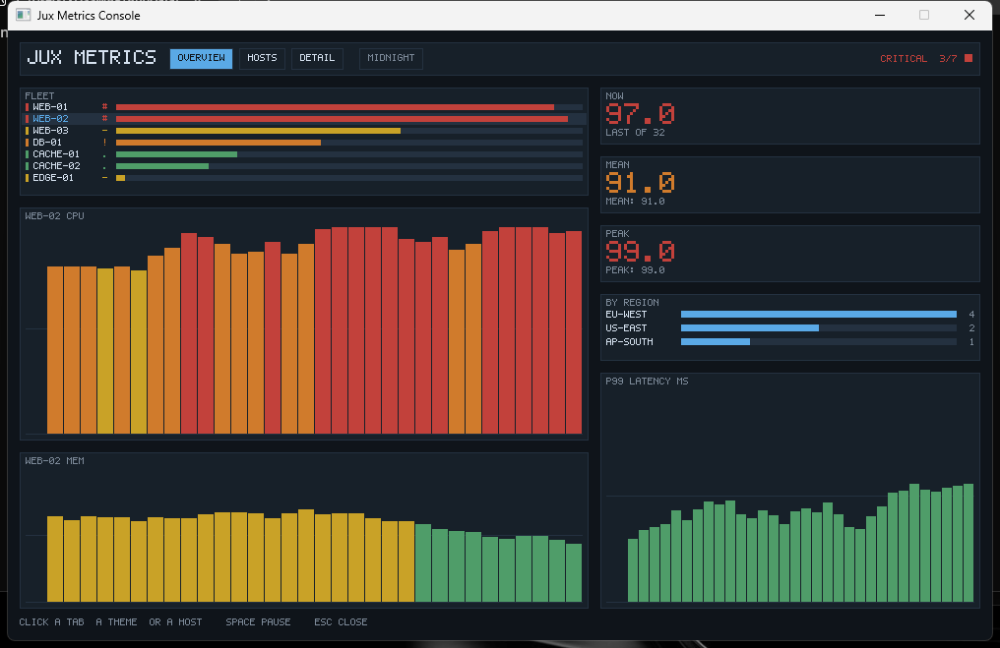
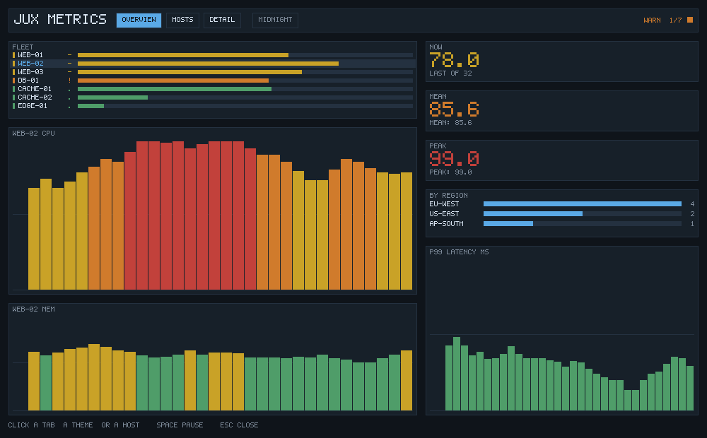
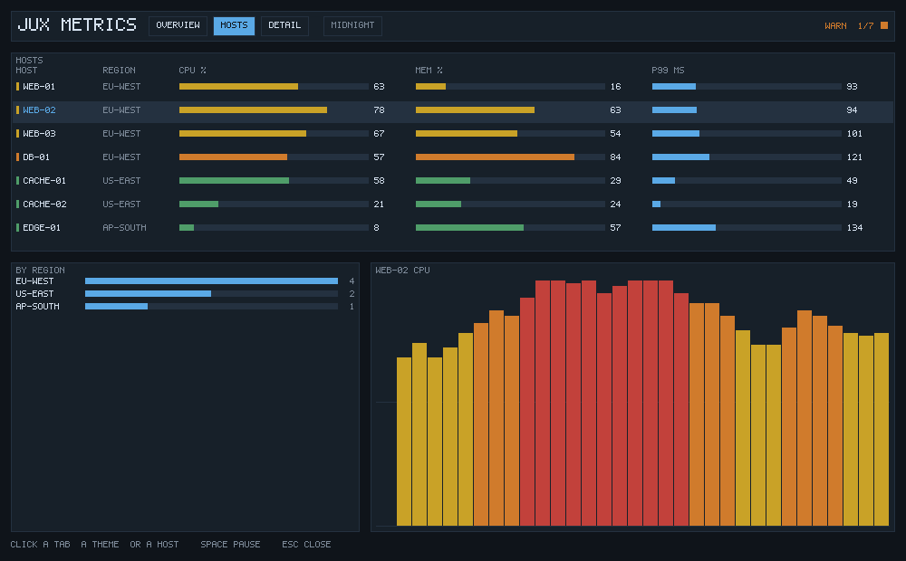

# Metrics Console

An interactive fleet dashboard, drawn pixel by pixel, in five Jux packages.



Three views, a clickable table, a theme you can switch, and a live feed. The
console owns a `Vec<int>` of 0xRRGGBB and draws into it, so nothing under
`demo.render` knows where the pixels end up or where a click came from. That
is what makes two front ends possible over one renderer: a desktop window,
and a file writer that runs on a machine with no display.

The second checks the first. Every interaction below is driven by the tests
through the same `Console.click` the window calls.

```
jux run -p desktop                 # a live window
jux run                            # render a frame, preview it as text
jux run -- --snapshot out.ppm      # write a plain-text PPM
jux run -- --view hosts            # pick the view
jux run -- --host db-01            # pick the selected host
jux run -- --theme paper           # the light palette
jux run -- --click 258 28          # click the frame, then draw it again
jux run -- --size 1280x800         # pick the frame size
```

The window is worth `--release`; a debug build redraws a million bounds-checked
pixels per frame and feels it.

## The views

**Overview** is the fleet at a glance: a clickable host table, the selected
host's two percentage charts, and three aggregates over one window.



**Hosts** compares. Every host, all three readings side by side, and the
region breakdown under it.



**Detail** is one host in full: three charts and three aggregates, each
graded against its own ceiling, which is why a 155ms p99 is not painted in
the red a 155% cpu would be.


Clicking a host row anywhere selects it and opens Detail. Clicking the chip
beside the tabs switches palette:


## Input

A widget that can be clicked registers the rectangles it drew into a shared
`HitMap`, under an action string:

```jux
this.hits.add(x - 4, ry - 2, w + 8, rowHeight, "host:" + host.name());
```

The console asks the map what is under a point and turns the answer into
state. Nothing else interprets a click, so a widget never learns what
selecting a host goes on to do, and the window front end forwards two
integers and no more:

```jux
var mouse = window.get_mouse_pos(MouseMode.Clamp);
if (mouse != null) {
    var (fx, fy) = mouse!!;
    console.hover((int) fx, (int) fy);
    if (down && !wasDown && console.click((int) fx, (int) fy)) { ... }
}
```

Which is why `--click 258 28` on the headless binary exercises exactly the
same path, and why the interaction is testable with no mouse attached.

## The packages

```
demo.core     containers and contracts, generic in the sample type
demo.model    a fleet, how bad a reading is, and a fleet that moves
demo.render   pixels, glyphs, widgets, hit regions, layout
demo.app      arguments, and where the frame goes
demo.desktop  the same frame, in a window
```

Each is its own package with its own `jux.toml`, and each compiles to its own
library; the last two produce binaries. The dependency edges run one way --
`app`/`desktop` -> `render` -> `model` -> `core` -- and nothing below `render`
knows a pixel exists, let alone a window.

### `demo.core`

`Ring<T>` is a fixed-capacity window: pushing past the capacity drops the
oldest sample. `Series<T>` gives one a name and a unit. `Table<K, V>` is an
insertion-ordered map, because a dashboard whose rows reorder between frames
is unreadable.

`Aggregate<T>` is the contract the console is built around:

```jux
public interface Aggregate<T> {
    double over(Ring<T> window);
    String label();

    default String render(Ring<T> window) {
        if (window.isEmpty()) {
            return this.label() + ": --";
        }
        return this.label() + ": " + Num.fixed1(this.over(window));
    }
}
```

`Mean`, `Peak` and `Latest` implement it. The three readouts down the right of
the frame are one window and three aggregates, which is the point: a widget
asks for a number without knowing what kind of number it is.

### `demo.model`

`Severity` is an enum with behaviour rather than a bare tag -- it knows its
own threshold, its colour, and its badge glyph, so adding a level is one edit
in one file instead of one per drawing site. `forPercent` walks `values()` in
declaration order and takes the last match.

`Host` records three metrics; `Fleet` holds hosts in insertion order and
answers the questions the header asks. `Simulation` moves them: a bounded
random walk from a seed the caller gives, so the same seed draws the same
dashboard, which is what lets a test assert on a frame at all.

### `demo.render`

`Canvas` is the pixel buffer and five primitives. `Font` is a 5x7 bitmap
written as pictures, one row per `|`, so a character is legible in the source.
`View` is an enum, and the tab bar draws itself from `values()` -- a new view
is a new tab and no list has to be kept in step.

`Widget` carries the panel chrome as a default method:

```jux
public interface Widget {
    void paint(Canvas c, Theme t, Text text, int x, int y, int w, int h);
    String title();

    default void render(Canvas c, Theme t, Text text, int x, int y, int w, int h) {
        c.rect(x, y, w, h, t.panel());
        c.frame(x, y, w, h, t.grid());
        text.draw(c, this.title().toUpperCase(), x + 6, y + 5, t.inkDim());
        this.paint(c, t, text, x + 6, y + 16, w - 12, h - 22);
    }
}
```

Every panel lines up without any of the five widgets agreeing to.

## What it exercises

Generic classes and interfaces across a package boundary, an interface with a
default method calling its own abstract members, generic type arguments that
are themselves user classes, an enum with methods and a `switch` over itself,
`Table<String, int>` read back through a nullable getter, a crates.io crate
used directly in Jux syntax, and a five-member workspace built in dependency
order from one `jux build`.

Writing it found nine compiler bugs that no single-file example could reach.

The tests in `bin/jux/tests/metrics_console.rs` run the headless binary nine
ways -- every view, every click target, both palettes -- and build the
windowed one.
