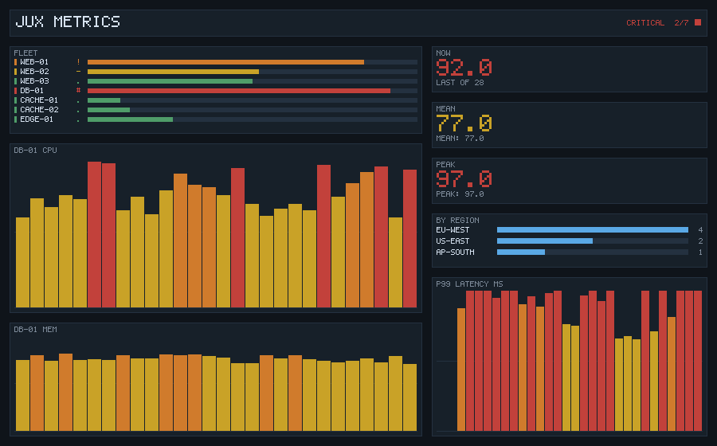

# Metrics Console

A fleet dashboard, drawn pixel by pixel, in four Jux packages.



No window library and no image library: the console owns a `Vec<int>` of
0xRRGGBB and draws into it, so the same code that would feed a window feeds a
file instead. That is what lets the whole render path run in a test on a
machine with no display, which it does.

```
jux run                        # render a frame, preview it as text
jux run -- --snapshot out.ppm  # write the frame to a plain-text PPM
jux run -- --size 1280x800     # pick the frame size
```

## The packages

```
demo.core     containers and contracts, generic in the sample type
demo.model    what a fleet is, and how bad a reading is
demo.render   pixels, glyphs, widgets, layout
demo.app      argument parsing, the sample fleet, and where the frame goes
```

Each is its own package with its own `jux.toml`, and each compiles to its own
library; only `demo.app` produces a binary. The dependency edges run one way
-- `app -> render -> model -> core` -- and nothing below `render` knows a
pixel exists.

### `demo.core`

`Ring<T>` is a fixed-capacity window: pushing past the capacity drops the
oldest sample. `Series<T>` gives one a name and a unit. `Table<K, V>` is an
insertion-ordered map, because a dashboard whose rows reorder between frames
is unreadable.

`Aggregate<T>` is the contract the console is built around:

```jux
public interface Aggregate<T> {
    double over(Ring<T> window);
    String label();

    default String render(Ring<T> window) {
        if (window.isEmpty()) {
            return this.label() + ": --";
        }
        return this.label() + ": " + Num.fixed1(this.over(window));
    }
}
```

`Mean`, `Peak` and `Latest` implement it. The three readouts down the right of
the frame are one window and three aggregates, which is the point: a widget
asks for a number without knowing what kind of number it is.

### `demo.model`

`Severity` is an enum with behaviour rather than a bare tag -- it knows its
own threshold, its colour, and its badge glyph, so adding a level is one edit
in one file instead of one per drawing site. `forPercent` walks `values()` in
declaration order and takes the last match.

`Host` records three metrics; `Fleet` holds hosts in insertion order and
answers the questions the header asks (`worst()`, `countAtLeast(level)`).

### `demo.render`

`Canvas` is the pixel buffer and five primitives. `Font` is a 5x7 bitmap
written as 35-character pictures, one per glyph, so a character is legible in
the source. `Text` is the policy on top of it: spacing, scaling, and what to
do with a character the table has no picture for.

`Widget` carries the panel chrome as a default method:

```jux
public interface Widget {
    void paint(Canvas c, Theme t, Text text, int x, int y, int w, int h);
    String title();

    default void render(Canvas c, Theme t, Text text, int x, int y, int w, int h) {
        c.rect(x, y, w, h, t.panel());
        c.frame(x, y, w, h, t.grid());
        text.draw(c, this.title().toUpperCase(), x + 6, y + 5, t.inkDim());
        this.paint(c, t, text, x + 6, y + 16, w - 12, h - 22);
    }
}
```

Every panel lines up without any of the four widgets agreeing to.

### `demo.app`

Parses the arguments, builds a fixed fleet from a fixed sequence of readings
so a snapshot is reproducible, and decides where the frame goes.

## What it exercises

Generic classes and interfaces across a package boundary, an interface with a
default method calling its own abstract members, generic type arguments that
are themselves user classes, an enum with methods and a `switch` over itself,
`Table<String, int>` read back through a nullable getter, and a four-member
workspace built in dependency order from one `jux build`.

The tests in `bin/jux/tests/metrics_console.rs` run it three ways and assert
on the frame it produces.
